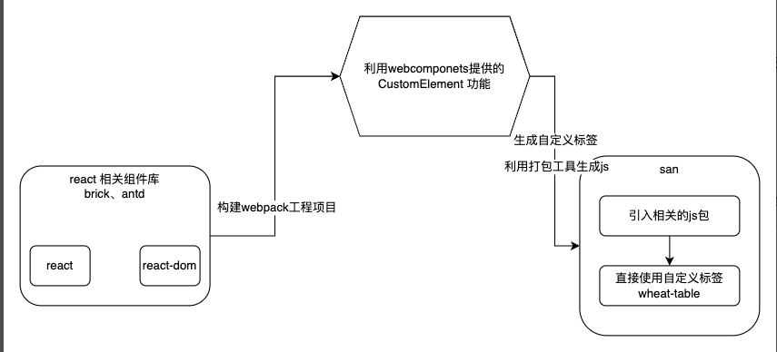

# antdTable for any frame

69行代码 实现一个san(百度自研框架)、vue、react都可以用的table组件

基于 webcomponents 封装一个通用组件库! 打破框架的隔阂.

看着这么多react 优秀的组件库，我们要想办法用上

### 技术实现

antd等等这些组件库的组件功能都比较全。应该充分利用上。毕竟都是js、html、css组成的。处理好隔离就能很好的使用。


# 在 Vue 中使用

```js
<template>
  <div class="hello">
    <wheat-table />
  </div>
</template>
<script>
  import 'web-component-wheat-ui/dist/table';
  import 'web-component-wheat-ui/dist/static/variables.css';
  export default {
    name: 'HelloWorld',
    props: {
      msg: String,
    },
    data() {
      return {
        data: [],
      };
    },
    mounted() {
      const tabBox = document.querySelector('wheat-table');
    // 更新表格列
    tabBox.setColumns([
      {
        title: 'Name',
        dataIndex: 'name',
        key: 'name',
      },
      {
        title: 'Age',
        dataIndex: 'age',
        key: 'age',
      },
      {
        title: 'Address',
        dataIndex: 'address',
        key: 'address',
      },
      {
        title: '编辑列',
        dataIndex: 'editRow',
        key: 'editRow',
        render: (text) => {
          return {
            componentName: 'Input',
            className: 'span-className',
            onChange: (e) => {
              console.log('e', e.target.value);
            },
          };
        },
      },
    ]);
    const dataSource = [];
    for (let index = 0; index < 30; index++) {
      dataSource.push({
        {
          key: index,
          name: 'John Brown',
          age: 32,
          address: `New York No. ${index} Lake Park`,
          editRow: 'John1',
        },
      })
    }
    tabBox.setDataSource(dataSource);
    },
    methods: {
      
    },
  };
</script>

<!-- Add "scoped" attribute to limit CSS to this component only -->
<style scoped>
  h3 {
    margin: 40px 0 0;
  }
  ul {
    list-style-type: none;
    padding: 0;
  }
  li {
    display: inline-block;
    margin: 0 10px;
  }
  a {
    color: #42b983;
  }
</style>
```

### 组件文档地址

[文档](https://glean-wheat.github.io/wheat-ui/storybook-static/?path=/docs/componentreact-table--primary)